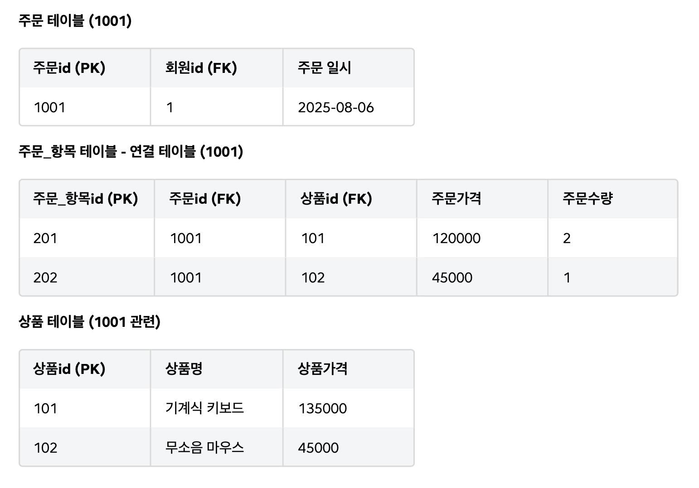

# sql-arch

# 데이터베이스 설계의 첫걸음

## 1️⃣ 설계의 중요성

* 데이터베이스 설계는 시스템의 **뼈대(설계도)** 를 만드는 과정.
* 초기에는 빠르지만, 설계 없이 구축하면 시간이 지날수록 **중복, 성능 저하, 유지보수 어려움** 발생.
* 체계적 설계는 데이터 무결성과 효율성을 높이는 **정규화 과정**을 포함.
* 잘된 설계 = 변화에 유연하고, 확장 가능한 시스템 기반.

---

## 2️⃣ 잘못된 설계의 문제

| 문제 유형          | 설명                              |
| -------------- | ------------------------------- |
| **데이터 무결성 훼손** | 중복 데이터로 인해 불일치 발생 (수정/삽입/삭제 이상) |
| **성능 저하**      | 불필요한 데이터 누적으로 조회 속도 감소          |
| **유지보수 비용 증가** | 작은 변경에도 테이블 구조 전체 수정 필요         |

### 🔹 이상 현상(Anomaly) 예시

* **수정 이상**: 한 정보 변경 시 여러 곳 수정 필요 → 누락 시 불일치 발생.
* **삽입 이상**: 불필요한 데이터 없이는 원하는 정보 입력 불가.
* **삭제 이상**: 특정 정보 삭제 시, 다른 중요한 정보까지 함께 삭제.

---

## 3️⃣ 데이터베이스 설계 3단계

| 단계              | 설명                                 | 주요 산출물                           |
| --------------- | ---------------------------------- | -------------------------------- |
| **1단계: 개념적 설계** | 비즈니스 요구사항 분석, 핵심 데이터(엔티티)와 관계 파악   | ERD(Entity Relationship Diagram) |
| **2단계: 논리적 설계** | 정규화 수행, 테이블 구조·PK·FK 정의 (DBMS 독립적) | 논리 모델 (테이블 정의서)                  |
| **3단계: 물리적 설계** | 특정 DBMS에 맞게 최적화, 컬럼 타입·인덱스 결정      | CREATE TABLE 스크립트                |

> 각 단계는 관점이 다르지만, 실무에서는 종종 혼용되어 사용됨.

---

## ✅ 요약

* 데이터베이스 설계 = **데이터 품질과 성능의 출발점**.
* 정규화를 통해 **중복 제거·무결성 확보**.
* 개념 → 논리 → 물리 설계의 3단계를 거치며, 변화에 강한 DB 구조 완성.

---

# 개념적 모델링

## 1️⃣ 개념적 모델링의 목적

* 기술적 용어 대신 **비즈니스 관점에서 모두가 이해 가능한 데이터 청사진**을 만드는 과정.
* 요구 사항 분석 시 **명사 → 엔티티**, **동사 → 관계**로 식별.
* 시스템이 저장·관리해야 할 ‘대상’을 엔티티로 도출.

---

## 2️⃣ 엔티티(Entity)

* 데이터를 저장하고 관리해야 할 **유무형의 대상** → 데이터베이스의 **테이블**에 해당.
* 좋은 엔티티의 특징:

    * 업무 관련성, 식별 가능성, 2개 이상 속성 보유, 인스턴스의 집합, 관계 보유.
* 엔티티 = 개념적 틀(시트), 인스턴스 = 실제 데이터 행.

---

## 3️⃣ 엔티티 분류

| 기준         | 유형               | 설명                 |
| ---------- | ---------------- | ------------------ |
| **존재 형태**  | 유형 / 개념 / 사건 엔티티 | 실체, 추상 개념, 행위 기록 등 |
| **역할·시점**  | 기본 / 중심 / 행위 엔티티 | 데이터 흐름 및 우선순위 결정   |
| **존재 종속성** | 강한 / 약한 엔티티      | 독립적 존재 vs 부모 의존    |

* **사건·행위 엔티티**는 데이터 증가가 빠르므로, 인덱스·파티셔닝·아카이빙 고려 필요.
* **연관 엔티티**: 다대다(M:N) 관계를 1:N 두 개로 분리하여 추가 속성 저장 가능.
* **슈퍼타입/서브타입**: 공통 속성과 차이를 구조적으로 표현.

---

## 4️⃣ 속성과 식별자

* **속성(Attribute)**: 엔티티의 구체적 정보 → 컬럼(Column).
* **식별자(Identifier)**: 각 인스턴스를 구분하는 고유 속성 → 기본 키(PK).

---

## 5️⃣ 관계의 세부 요소

| 요소                     | 설명                                             |
| ---------------------- | ---------------------------------------------- |
| **카디널리티(Cardinality)** | 한 엔티티 인스턴스가 다른 엔티티와 맺는 최대 관계 수 (1:1, 1:N, M:N) |
| **참여도(Optionality)**   | 관계 참여가 필수(Mandatory)인지 선택(Optional)인지          |

---

## 6️⃣ ERD(Entity-Relationship Diagram)

* 엔티티, 속성, 관계를 **시각적으로 표현**한 데이터 구조 청사진.
* **Crow’s Foot 표기법**이 표준: 선의 끝기호로 **카디널리티 + 참여도** 표현.

---

## 7️⃣ 연관 엔티티 (Associative Entity) — M:N 관계 해결

* **M:N 관계의 문제점:**

    * 관계형 DB에서는 M:N 관계를 물리적으로 구현할 수 없음.
    * 관계 자체에 속한 정보(예: 주문수량, 주문가격)를 저장할 공간이 없음.
* **잘못된 설계 예:**

    * 여러 상품 ID 컬럼을 추가하거나 한 컬럼에 여러 값을 넣는 경우 → **확장성, 원자성, 검색성 모두 악화**.
* **해결책:**

    * M:N 관계를 새로운 엔티티로 승격시켜 **두 개의 1:N 관계로 분리.**
    * 예: `주문(Order)` ↔ `주문_항목(Order_Item)` ↔ `상품(Product)`
    * `주문_항목` 테이블에 `주문수량`, `주문가격` 등의 관계 속성을 저장.
* **실무 용어:** 연결 테이블(Link Table), 조인 테이블(Join Table), 매핑 테이블(Mapping Table).
* **핵심:** 모든 M:N 관계는 현실적으 로 **연관 엔티티로 해소**되어야 하며, 관계 시점의 속성을 반드시 찾아야 한다.

---

## 8️⃣ 용어 사전 (Data Dictionary)

* 비즈니스 용어 ↔ DB 객체명을 일관되게 관리하는 문서.
* `회원(member)`, `가격(price)` 등 **단일어 중심 정의** 후 조합 사용.
* 프로젝트 진행 중 **지속적 업데이트되는 살아있는 문서.**

---

## ✅ 핵심 요약

* 개념적 모델링 = **데이터 세상의 설계도**.
* 명사 → 엔티티, 동사 → 관계.
* 엔티티·속성·관계·식별자·카디널리티를 명확히 정의해 **ERD로 시각화**.
* **M:N 관계는 반드시 연관 엔티티로 해소하여 관계 속성까지 관리.**
* 용어 사전은 조직 내 **공통 언어 체계**를 구축하는 핵심 도구.

---

# 개념적 모델링 실전

## 1️⃣ 실전 요구 사항 분석

* 훌륭한 개발자는 단순한 기능 구현을 넘어 **왜 이 기능이 필요한가**를 고민한다.
* 이해관계자(기획, 사업팀)와의 소통을 통해 **핵심 기능을 선별**하고 불필요한 기능을 배제한다.
* 기술적 완성도보다 **비즈니스 목표 달성**이 우선이다.

---

## 2️⃣ 실전 개념적 모델링 — 시작

| 단계                | 설명                                                  |
| ----------------- | --------------------------------------------------- |
| **MVP 정의**        | 시장에서 생존하기 위한 최소 기능(`회원`, `상품`, `주문`, `결제`, `배송`) 정의 |
| **핵심 엔티티 도출**     | MVP 기반으로 시스템의 뼈대를 이루는 핵심 엔티티 식별                     |
| **속성 정의 및 관계 설정** | 각 엔티티의 주요 속성을 정의하고, 1:1 / 1:N / M:N 관계를 설정          |
| **M:N 관계 해소**     | `주문`과 `상품`의 M:N 관계를 `주문 항목(Order_Item)` 연관 엔티티로 분리  |

> ✅ 연관 엔티티 도입으로 **물리적 구현 불가 문제 + 관계 속성 저장 문제**를 모두 해결.

---

## 3️⃣ 실전 개념적 모델링 — ERD 작성

* **개념적 모델 ERD**: 핵심 엔티티와 관계를 시각적으로 표현한 데이터 구조 청사진.
* **목적**: 모든 팀원이 공통된 이해를 갖도록 돕는 **소통의 지도(Map)**.
* **외래 키(FK) 생략**: 특정 DBMS 기술에 종속되지 않도록, 개념적 단계에서는 관계만 선으로 표현.
* **실무 적용**: 관계형 DB를 전제로 FK를 포함한 설계로 빠르게 이행하는 경우도 많음.

---

## 4️⃣ 실전 개념적 모델링 — 용어 사전 작성

* **용어 사전의 중요성**: 엔티티·속성 명칭을 명확히 정의하여 **팀 간 소통 일관성 확보.**
* **작성 기준**: 엔티티명, 영문명, 축약어, 설명을 포함.
* **일관성 유지**: `ship_quantity`처럼 누구나 예상 가능한 일관된 이름 사용.
* **살아있는 문서 관리**: Notion, Confluence 등에서 지속적으로 업데이트 및 공유.

---

## ✅ 핵심 요약

* 개념적 모델링의 출발점은 **비즈니스 이해와 핵심 기능 도출.**
* **M:N 관계는 반드시 연관 엔티티로 해소**하고 관계 속성을 저장해야 함.
* ERD는 기술적 도면이 아닌 **조직 내 공통 이해를 위한 시각적 언어.**
* 용어 사전은 **개발, 기획, 데이터 분석팀이 공유하는 공통 언어 체계.**

---

# 데이터베이스 논리적 모델링 — 키(Key) 

## 1️⃣ 키의 개념

* 논리적 모델링은 개념 모델을 관계형 데이터베이스 구조로 변환하는 단계이며, **키 정의**가 핵심이다.
* 키는 각 행(Row)을 유일하게 식별하고, 테이블 간 관계를 연결하며, 데이터 무결성을 보장한다.

| 키 종류                     | 설명                                |
| ------------------------ | --------------------------------- |
| **기본 키 (Primary Key)**   | 테이블의 대표 식별자. NULL 불가, 유일성, 불변성 유지 |
| **후보 키 (Candidate Key)** | 기본 키가 될 수 있는 후보 키로, 유일성과 최소성을 만족  |
| **외래 키 (Foreign Key)**   | 다른 테이블의 기본 키를 참조해 관계를 연결          |

---

## 2️⃣ 자연 키 vs 대리 키

### 🔹 자연 키 (Natural Key)

* 예: 주민등록번호, 이메일 등 **의미 있는 비즈니스 데이터**.
* 단점: 변경 가능 → 참조 무결성 위반, 시스템 부하, 데이터 불일치 초래.

### 🔹 대리 키 (Surrogate Key)

* 예: Auto Increment ID, UUID 등 **시스템이 생성한 식별자**.
* 장점: 비즈니스 로직과 분리, 불변성 유지, 관리 용이.

> ✅ 현대 표준: **대리 키 → PK / 자연 키 → UNIQUE 제약조건 적용**

---

## 3️⃣ 성능 및 설계 트레이드오프

| 구분     | 자연 키              | 대리 키                     |
| ------ | ----------------- | ------------------------ |
| **장점** | 단순 조회 시 JOIN 불필요  | 외래 키 크기 작아 효율적, 쓰기 성능 우수 |
| **단점** | 변경 위험, 외래 키 크기 증가 | JOIN 필요, 의미 없음           |

* 대부분의 시스템은 **데이터 모델 안정성, 유연성, 성능**을 이유로 대리 키를 선택.
* 비즈니스 로직 변경에도 안정적인 구조 유지 → **Loose Coupling(느슨한 결합)** 실현.

---

## 4️⃣ 복합 키 (Composite Key)

* 두 개 이상의 컬럼을 묶어 하나의 기본 키로 사용하는 방식.
* 문제점: 변경 위험, 외래 키 복잡성, ORM 매핑 어려움.
* **대안:**

    * 대리 키를 기본 키(PK)로 사용.
    * 복합 컬럼에는 **UNIQUE 제약조건**을 적용.

---

## 5️⃣ 다대다 관계와 연결 테이블

* M:N 관계 해소를 위해 **연결 테이블(Bridge Table)**을 생성.
* 기본적으로 두 외래 키를 복합키로 지정할 수 있으나, 이는 복잡성과 제약을 초래.
* **권장 방식:**

    * 연결 테이블에도 별도의 **대리 키(PK)** 생성.
    * 두 외래 키에는 **복합 UNIQUE 제약조건** 부여.

> ✅ 이 방식은 대리 키의 단순성과 복합키의 정합성 보장을 동시에 달성.

---

## ✅ 핵심 요약

* 키는 데이터 식별과 관계 설정의 핵심 장치.
* **대리 키 = PK**, **자연 키 = UNIQUE 제약조건** → 현대 설계의 표준.
* 복합키보다 **대리 키 기반 구조**가 유지보수와 확장성 측면에서 유리하다.

---

# 논리적 모델링 — 참여도와 일대다(1:N) 관계

## 1️⃣ 관계의 개념

* 개념적 모델의 추상적 관계를 **외래 키(Foreign Key)** 로 구체화한 것이 논리적 모델의 관계.
* 관계형 DB의 관계는 **방향성이 없으며**, 외래 키 하나로 **양방향 조회 가능.**
* 관계의 핵심 속성:

    * **카디널리티(Cardinality)**: 한 행이 다른 테이블의 몇 개 행과 연결되는가 (1:1, 1:N, M:N)
    * **참여도(Optionality)**: 관계에 반드시 참여해야 하는가 (필수/선택)

---

## 2️⃣ 참여도(Optionality)

* 관계 참여의 필수 여부를 의미.
* **논리적 구현 방식:** 외래 키 컬럼의 `NULL` 허용 여부로 제어.

    * `NOT NULL` → 필수 참여
    * `NULL` → 선택 참여 가능
* 외래 키가 없는 ‘일(1)’ 쪽의 필수 참여는 DB 제약만으로는 불가능하며, **애플리케이션 로직**으로 처리해야 함.
* ERD에는 비즈니스 규칙을 반드시 명시하여 가시성 확보.

---

## 3️⃣ 일대다(1:N) / 다대일(N:1) 관계 — 외래 키 위치

* **가장 일반적인 관계 형태.**
* 외래 키는 **항상 ‘다(N)’ 쪽에 위치해야 함.**
* 이유:

    * 데이터의 **원자성(Atomicity)** 유지.
    * **확장성 및 무결성** 확보.
    * ‘일(1)’ 쪽에 FK를 두면 제1정규형 위반 및 데이터 불일치 발생.

| 구분             | 역할      |
| -------------- | ------- |
| **부모 테이블 (1)** | 외래 키 없음 |
| **자식 테이블 (N)** | 외래 키 보유 |

> ✅ 결론: 외래 키는 항상 ‘다(N)’ 쪽에 존재해야 한다.

---

## 4️⃣ 조인(Join) 시 주의점

* **1:N 조인 (일 기준)**: 부모(1)를 기준으로 조인 시, N쪽 데이터 수만큼 **행이 복제되어 뻥튀기 발생** 가능.
* **N:1 조인 (다 기준)**: 자식(N)을 기준으로 조인 시, 데이터 수 증가 없음 → **안정적인 결과.**

---

## ✅ 핵심 요약

* 논리적 모델링에서 관계는 **외래 키를 통해 구현.**
* **참여도 → NULL 제약조건**, **카디널리티 → 관계 수(1:1, 1:N 등)** 로 표현.
* 외래 키는 **반드시 ‘다(N)’ 쪽에 위치**해야 하며, 이는 데이터 무결성과 확장성을 보장하는 기본 원칙.
* 조인 시 **1:N 관계에서는 뻥튀기 주의**, **N:1 방향으로 조회하는 것이 안정적.**

---

# 논리적 모델링 — 일대일(1:1) 및 다대다(M:N) 관계

## 1️⃣ 일대일(1:1) 관계

* **1:1 관계는 드물지만**, 보안 강화, 선택적 정보 분리, 성능 최적화, 관심사 분리를 위해 사용됨.
* **DB에서 1:1 관계 강제 조건:** 외래 키(FK)에 `UNIQUE` 제약조건 추가.

### 🔹 외래 키 위치

| 위치             | 특징                                            | 비고        |
| -------------- | --------------------------------------------- | --------- |
| **보조 테이블에 FK** | 주 테이블 변경 없이 확장 가능 → **유연성 높음**, 향후 1:N로 변경 용이 | ✅ 권장 방식   |
| **주 테이블에 FK**  | 필수 관계(`NOT NULL`)나 조회 성능이 극도로 중요할 때 사용        | ⚠️ 예외적 상황 |

> ✅ **보조 테이블에 FK + UNIQUE 제약조건** → 확장성과 유지보수성 모두 확보.

### 🔹 관계 확장의 유연성

* `UNIQUE` 제약만 제거하면 1:1 → 1:N으로 자연스럽게 확장 가능.
* **주 테이블 구조 변경 없이** 관계의 카디널리티를 변경할 수 있어 OCP(개방-폐쇄 원칙)를 만족.

---

## 2️⃣ 다대다(M:N) 관계

* **관계형 모델의 한계:** 원자성, PK 유일성, FK 단일 참조 제약으로 인해 **두 테이블만으로 M:N 관계 구현 불가.**

### 🔹 해결책 — 연결 테이블(Junction Table)

* M:N 관계를 **두 개의 1:N 관계로 분해.**
* 연결 테이블은 양쪽 테이블의 기본 키를 외래 키로 가지며, **두 테이블을 이어주는 다리 역할.**
* `JOIN`을 통해 양방향 조회 가능.

### 🔹 속성 추가 시 — 연관 엔티티(Associative Entity)

* 대부분의 M:N 관계는 **관계 자체에 속성(예: 주문수량, 주문가격)** 이 존재.
* 이 경우 연결 테이블은 단순 연결을 넘어 독립적 의미를 가지는 **연관 엔티티**가 됨.
* 예: `주문` ↔ `상품` 관계 → `주문_항목(Order_Item)` 테이블 생성.

---

## 3️⃣ 개념적 vs 논리적 모델링 차이

| 구분            | 개념적 모델링       | 논리적 모델링            |
| ------------- | ------------- | ------------------ |
| **속성 없는 M:N** | 단순 M:N 관계로 표현 | 연결 테이블로 1:N 관계로 분리 |
| **속성 있는 M:N** | 연관 엔티티로 표현    | 독립 테이블로 구현         |

> 💡 실무에서는 대부분 M:N 관계에 **숨겨진 속성**이 존재하므로, 관계에 포함될 정보가 무엇인지 항상 고민해야 한다.

---

## ✅ 핵심 요약

* **1:1 관계:** 보조 테이블에 FK + UNIQUE 제약조건 (확장성 확보)
* **M:N 관계:** 연결 테이블로 1:N 구조로 분리 (속성 존재 시 연관 엔티티로 승격)
* **실무 팁:** 대부분의 M:N 관계는 관계 자체에 의미 있는 속성을 포함한다 → 반드시 분석 필요.

